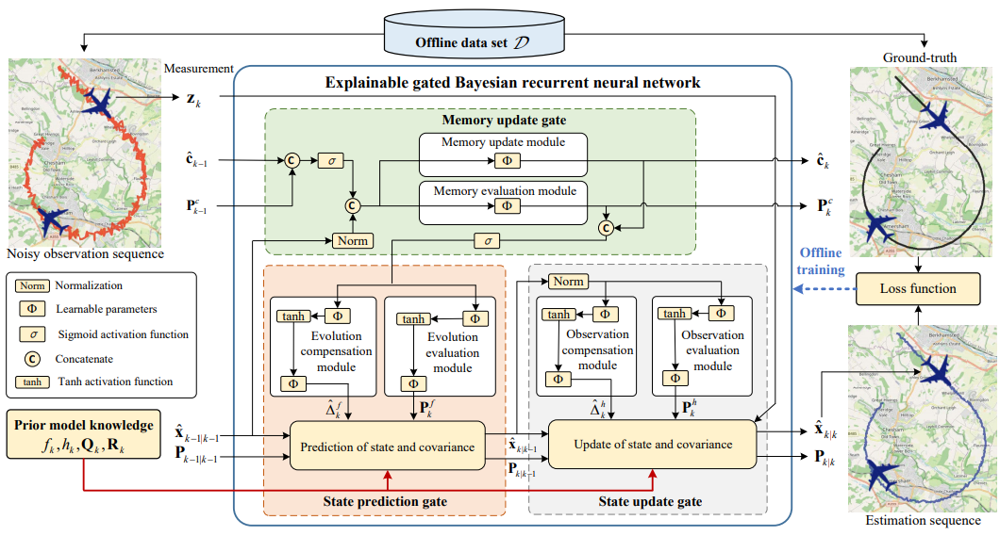

# EGBRNN: Explainable Gated Bayesian Recurrent Neural Network for Non-Markov State Estimation

This repository is the official implementation of [Explainable Gated Bayesian Recurrent Neural Network for Non-Markov State Estimation](https://ieeexplore.ieee.org/abstract/document/10508326).

.


## Requirements

The code contains the tensorflow and pytorch implementations of EGBRNN. Different experiments are placed in different paths, each with a corresponding requirement.txt file. To install requirements:

```setup
pip install -r requirements.txt
```
## Data
We provide data for each experiment, which are under the path of the corresponding experiment. You can also regenerate or download the raw data.

For "Non-Markov series", you can use "Non-Markov series/data/data_generate.py" to generate corresponding data.

For "Aircraft tracking", you can download raw flight records with format "lt6" from the [open resource repository](https://c3.ndc.nasa.gov/dashlink/resources/132/). 
The matlab and python programs used to process the raw data are in the following paths:
~~~~
├── Raw_data_processing
   ├── lt6_to_mat  #  Step 1. Matlab code for processing raw flight records in lt6 format.
   └── mat_to_npy  #  Step 2. Python code for processing data in mat format.
~~~~

For NCLT localization, you can download raw records from [NCLT dataset](https://robots.engin.umich.edu/nclt/). 

For lorenz attractor, you can generate the data as that in [KalmanNet](https://github.com/KalmanNet/KalmanNet_TSP).

## Training & Testing

The code for each experiment can be find in its corresponding path. We finely commented the code for EGBRNN (tensorflow) in Aircratf tracking, Non-Markov series, and NCLT localization. 
In each experiment (tensorflow):

(1) to train the EGBRNN, please execute:
```Train_EGBRNN.py```

(2) to test the EGBRNN, please execute:
```Test_EGBRNN.py```

For example,

~~~~
├── Filter_and_Smoother_TF
   └── Deep_Bayesian_Filter
         ├── Air_tracking
            ├── EGBRNN
               ├── EGBRNN_train.py
               ├── EGBRNN_test.py
~~~~

For the pytorch version of EGBRNN, to train and test the EGBRNN, please execute:
```task_filter.py```

<!-- ## Visualisation of Predicted Results
FlightLLM enables highly accurate trajectory prediction in line with flight dynamics.


## Uncertainty Quantification
FlightLLM can effectively measure the uncertainty of predictions.
 -->

## Note

If your work involves this code, please pay attention to our our papers: 

[1]Yan S, Liang Y, Zheng L, et al. Explainable Gated Bayesian Recurrent Neural Network for Non-Markov State Estimation[J]. IEEE Transactions on Signal Processing, 2024.

[2]Yan S, Liang Y, Zhang H, et al. Explainable Bayesian Recurrent Neural Smoother to Capture Global State Evolutionary Correlations[J]. arXiv preprint arXiv:2406.11163, 2024.

[3]Yan S, Liang Y, Zheng L, et al. Memory-biomimetic deep Bayesian filtering[J]. Information Fusion, 2024, 112: 102580.

